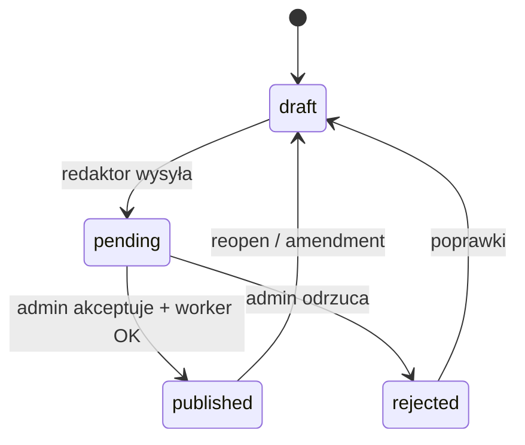

# OmniPress — opis produktu

Headless CMS: redaktorzy przygotowują treść w panelu, administrator akceptuje i publikuje na stronie **Astro** (GitHub + Vercel).

**Stan techniczny (szczegóły):** [docs/STATUS.md](docs/STATUS.md)

---

## Cel

- Redaktorzy **nie** potrzebują dostępu do GitHub ani Vercel strony docelowej.
- Jeden panel do tworzenia wpisów, galerii i załączników PDF.
- Administrator kontroluje akceptację i publikację na repozytorium Astro.

---

## Model danych (skrót)

| Encja | Opis |
|-------|------|
| `sites` | Jednostka organizacyjna (np. UG Miedzna) |
| `destinations` | Kanał publikacji — typ `github_astro` (repo, branch, ścieżka contentu) |
| `site_destinations` | Powiązanie strony z destynacją |
| `posts` | Wpis redaktora (`draft` → `pending` → `publishing` → `published` / `rejected`) |
| `post_assets` | Zdjęcia i PDF w Supabase Storage |
| `publish_logs` | Log publikacji per destynacja |
| `profiles` / `user_sites` | Użytkownicy i dostęp do stron |

---

## Workflow treści

---

## Publikacja GitHub-Astro

- Commit pliku Markdown (frontmatter) + upload assetów do repo.
- Układ: `flat` (`slug.md`) lub `folder` (`slug/index.md`).
- Kategorie z pliku `omnipress-categories.json` w repo.
- Layout strony (menu, sloty) synchronizowany z panelu admina.
- Worker z retry; opcjonalna weryfikacja deployu Vercel.

---

## Role

**Redaktor** — własne wpisy na przypisanych stronach; bez widoku tokenów i cudzych szkiców.

**Administrator** — jednostki, redaktorzy, akceptacja, import z GitHub, layout, dezaktywacja/usuwanie na stronie.

---

## Stack

Astro SSR · Tailwind · Supabase · Vercel · TipTap · GitHub API

---

## Poza zakresem (obecnie)

Powiadomienia e-mail, MFA admina, audit log, SSO, wersjonowanie treści (`post_revisions`).
