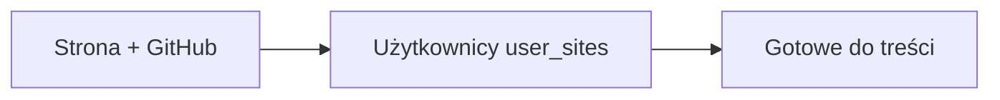

# Podręcznik administratora

Operacyjny przewodnik po panelu OmniPress. Stan funkcji: [STATUS.md](./STATUS.md).

**URL produkcji:** https://omni-press.cncsolutions.dev/admin

---

## 0. Nawigacja panelu

- **Nagłówek** (u góry): przyciski *Administracja* (`/admin`) i *Panel treści* (`/dashboard`) — lewe menu zależy od wyboru (panel treści nie ma sidebar).
- **Sidebar** (tylko w `/admin/*`, po lewej): *Kolejka wpisów* (`/admin`), *Wszystkie wpisy* (`/admin/posts`), *Strony* (`/admin/sites`), *Użytkownicy* (`/admin/users`). Na mobile — pozioma belka nad treścią.
- **Breadcrumby** na każdej podstronie pokazują ścieżkę (np. `Administracja / Strony / UG Miedzna / Strony statyczne`).
- W kontekście strony (`/admin/units/[id]/*`) zakładki pogrupowane:
  - **Wygląd strony:** *Menu* (`/navigation`), *Kategorie* (`/categories`), *Komponenty* (`/components`)
  - **Treść:** *Strony statyczne* (`/pages`), *Ostatnie zmiany* (`/changes`)
  - **Ustawienia** (`/admin/units/[id]`) — nazwa, slug, kanał GitHub i tokeny w jednym formularzu (na końcu subnav)
- Stare trasy `/admin/units/[id]/layout` → *Menu*, `/admin/units/[id]/publish` → *Ustawienia* (301).
- `/admin/posts` to pełna lista wpisów wszystkich redaktorów (także szkiców) z filtrami — patrz §5.1.
- `/admin` to wyłącznie kolejka wpisów — sekcje (*Do akceptacji*, *Zaplanowane / w publikacji*, *Na stronie*) mają u góry ścieżkę workflow i liczniki; wpisy w trakcie publikacji są w sekcji *Zaplanowane* ze znacznikiem **Publikacja…**; z listy można szybko zaakceptować; import z GitHub jest zwijaną sekcją na dole.

---

## 1. Pierwsza konfiguracja (kolejność)

**Jednostka organizacyjna:** `/admin/units/new` — nazwa, slug i kanał GitHub w jednym kroku. Po utworzeniu edycja w zakładce **Ustawienia** (`/admin/units/[id]`).

1. **Strona** — np. „UG Miedzna”, repo `mbatorowicz/gmina-miedzna.pl`, layout `folder`, ścieżka `src/content/news`.
2. **Redaktor** (`/admin/users`) — utwórz konto z rolą *redaktor*, przypisz strony + domyślna strona.
3. Redaktor loguje się na `/login` → `/dashboard`.

Szczegóły wdrożenia technicznego: [WDROZENIE.md](./WDROZENIE.md).

---

## 2. Strony (`/admin/sites`)

Lista stron jako **kafelki** — kliknięcie kafelka otwiera ustawienia strony (`/admin/units/[id]`); kafelek *+ Dodaj stronę* otwiera kreator (`/admin/units/new`).

| Pole | Opis |
|------|------|
| Nazwa | Wyświetlana w panelu |
| Slug | Identyfikator techniczny (`a-z`, `0-9`, myślnik) |
| Aktywna | Nieaktywna strona — bez nowych wpisów (docelowo) |

Ustawienia strony: `/admin/units/[id]` — nazwa, slug, repozytorium, branch, ścieżka contentu, tokeny, opcjonalnie Vercel.

---

## 3. Publikacja GitHub → Astro

| Pole | Przykład |
|------|----------|
| Repozytorium | `mbatorowicz/gmina-miedzna.pl` |
| Branch | `main` |
| Ścieżka contentu | `src/content/news` |
| Układ | folder (`slug/index.md`) |
| Token PAT GitHub | fine-grained (`github_pat_…`), Contents RW + Metadata R — tylko repo strony |
| ID projektu Vercel | opcjonalnie — sprawdzanie logu buildu po publikacji |

**Credentials** są szyfrowane (`ENCRYPTION_KEY` na Vercel). Bez klucza — zapis konfiguracji bez sekretów (tylko dev).

Po akceptacji wpisu worker publikuje na GitHub; opcjonalnie czeka na deploy Vercel i zapisuje błędy buildu w logach.

---

## 4. Użytkownicy (`/admin/users`)

Konta **administratorów i redaktorów** w jednym panelu (stare `/admin/editors` przekierowuje tutaj).

- **Tworzenie:** przycisk **„+ Nowy użytkownik”** otwiera okno modalne — e-mail + hasło startowe + rola (administrator / redaktor); redaktorowi zaznacz **dostępne strony** i **domyślną stronę** (używaną przy „+ Nowy artykuł”).
- **Ustawienia konta** (`/admin/users/[id]`): nazwa wyświetlana, zmiana roli, nowe hasło.
- **Uprawnienia:** redaktor — przypisane strony + domyślna; administrator — pełny dostęp.
- **Usuwanie:** konto znika, wpisy zostają w systemie (autor: „konto usunięte”). Nie można usunąć własnego konta ani ostatniego administratora.
- Redaktor widzi **tylko własne** wpisy; nie widzi tokenów.

---

## 5. Akceptacja wpisów

1. `/admin` → sekcja *Do akceptacji* → wpis.
2. **Popraw wpis** (opcjonalnie, przed decyzją) — przycisk nad podglądem otwiera edytor (`/admin/posts/[id]/edit`) z pełnym zestawem pól redaktora: kategoria, tytuł, slug, data i godzina publikacji, treść, galeria (kolejność, zajawka) oraz **tryb każdego PDF-a — link do pobrania albo podgląd na stronie**. Można też dodawać i usuwać załączniki.
   - *Zapisz zmiany* wraca do ekranu akceptacji; **status wpisu się nie zmienia** i redaktor nie dostaje powiadomienia — korekta nie zastępuje odrzucenia z uwagami.
   - Dostępne dla statusów: *Szkic*, *Do poprawki*, *Do akceptacji*, *Zaplanowany*. Wpis w trakcie publikacji lub już na stronie wymaga *Oddaj do poprawki* / *Zdejmij ze strony*.
3. **Zaakceptuj:** *Zaakceptuj i opublikuj* — wpis trafia do kolejki publikacji. Przy szkicu i wpisie do poprawki przycisk nazywa się *Opublikuj szkic* — patrz §5.2.
   - Jeśli data publikacji **już minęła** lub jest teraz → status `publishing`, publikacja startuje od razu.
   - Jeśli data w **przyszłości** → status `scheduled`, wpis w sekcji *Zaplanowane*; publikacja po terminie (przy wejściu na `/admin` lub cronie Vercel).
   - `publish_logs`: `pending` (z `next_retry_at` przy harmonogramie) → worker → `success` / `failed`.
   - Po sukcesie: `published`. Data w frontmatter strony = data wybrana przez redaktora.
4. **Odrzuć:** obowiązkowe uwagi → redaktor widzi `rejection_note` i może poprawić szkic. Odrzucenie dotyczy tylko wpisów *Do akceptacji* — szkicu redaktor nie wysłał, więc nie ma czego odrzucać.

Na podglądzie wpisu: tabela **Status publikacji**. Przy błędzie (`failed`): **Ponów publikację**.

### 5.2 Szkic redaktora na stronę — dwie drogi

Administrator domyka wpis sam, kiedy redaktor nie może (urlop, choroba, pilny komunikat). Ekran
akceptacji (`/admin/posts/[id]`) działa dla statusów *Szkic*, *Do poprawki* i *Do akceptacji*.

| Droga | Kroki | Kiedy |
|-------|-------|-------|
| **Skrót** | *Opublikuj szkic* na ekranie akceptacji | Treść jest gotowa, liczy się czas |
| **Ścieżka redaktora** | *Popraw wpis* → *Wyślij do akceptacji* → *Zaakceptuj i opublikuj* | Wpis ma przejść normalny obieg (wpis w kolejce, ślad w statusach) |

- **Tytuł i kategoria są wymagane** — bez nich przycisk publikacji jest zablokowany, a nad nim
  widać, czego brakuje. Uzupełnij w *Popraw wpis*.
- **Data publikacji:** pusta = publikacja od razu (data wpisu na stronie = moment akceptacji);
  data w przyszłości = status *Zaplanowany* i publikacja o wskazanej godzinie.
- **Wysłanie za redaktora** blokuje mu edycję (status *Do akceptacji*), więc uprzedź go poza
  systemem — powiadomień e-mail w tej wersji nie ma.
- Jeśli redaktor wyśle wpis w tej samej chwili, gdy administrator go publikuje, wygrywa jedna
  operacja — druga kończy się komunikatem, że wpisu nie można już skierować do publikacji.

### 5.1 Wszystkie wpisy — szkice redaktorów, filtry i sortowanie (`/admin/posts`)

Kolejka (`/admin`) pokazuje tylko to, co czeka na decyzję lub jest już na stronie. Pełny obraz —
razem ze **szkicami** i wpisami **do poprawki**, których redaktorzy jeszcze nie wysłali — jest na
`/admin/posts` (sidebar: *Wszystkie wpisy*).

| Element | Do czego służy |
|---------|----------------|
| Zakładki statusów | Jeden klik na *Szkic*, *Do akceptacji*, *Zaplanowany*, *Publikacja…*, *Na stronie*, *Do poprawki*; liczba w odznace = ile wpisów ma ten status |
| *Szukaj w tytule* | Fraza z tytułu (bez znaków wieloznacznych) |
| *Status*, *Strona*, *Autor* | Zawężenie listy; **Filtruj** zatwierdza |
| *Sortowanie* | Ostatnia zmiana / data utworzenia / tytuł, rosnąco lub malejąco |
| Nagłówki *Tytuł*, *Utworzono*, *Ostatnia zmiana* | Klik sortuje po kolumnie, drugi klik odwraca kolejność |
| **Otwórz** | Podgląd wpisu (`/admin/posts/[id]`) |
| **Edytuj** | Edytor treści (`/admin/posts/[id]/edit`) — widoczny dla statusów *Szkic*, *Do poprawki*, *Do akceptacji*, *Zaplanowany* |

Lista jest stronicowana po 25 wpisów; filtry, sortowanie i numer strony siedzą w adresie, więc widok
(np. „szkice redaktora X”) można zapisać w zakładkach przeglądarki.

**Edycja szkicu redaktora** działa jak korekta z §5 pkt 2: zapis **nie zmienia statusu**, więc wpis
zostaje szkicem u redaktora. Osobne przyciski przenoszą go dalej: *Wyślij do akceptacji* w edytorze
albo *Opublikuj szkic* na ekranie akceptacji (§5.2). Redaktor nie dostaje powiadomienia (brak
e-maili w tej wersji), więc przy większych zmianach uprzedź go poza systemem.

---

## 6. Wygląd strony, sync i bulk

Model **szkic + auto-pull + jawna publikacja**: edycja zapisuje roboczy stan w Supabase; strona live czyta pliki z GitHub. Przy wejściu na panel Omni **sam** wczytuje zmiany z `origin/main`, gdy nie masz niewysłanych poprawek. Publikacja na stronę wymaga kliknięcia **Opublikuj na stronie**.

| Akcja | Supabase (szkic) | GitHub | Vercel |
|-------|------------------|--------|--------|
| **Wejście na panel** | uzupełnia brakujące / puste z live | odczyt | nie |
| **Zapisz szkic** | tak | nie | nie |
| **Opublikuj na stronie** | tak (przed sync) | commit | webhook |

- **Menu:** `/admin/units/[id]/navigation` — edytor drzewa nawigacji (do 3 poziomów). Publikacja wysyła tylko `omnipress-navigation.json`. Przed publikacją walidacja linków wewnętrznych.
- **Kategorie:** `/admin/units/[id]/posts` — slug, nazwa i układ archiwum. „Opublikuj kategorie na stronie” nakłada listę na aktualny `omnipress-layout.json` (menu i stopka zostają z live). Feedy i menu ustawiasz osobno w Komponentach / Nagłówku.
- **Komponenty:** `/admin/units/[id]/components` — lista slotów (`home.*`, `sidebar.weather`, `sidebar.cert_advisories`, `sidebar.recent_changes`, `sidebar.banner` itd.) w tym samym pliku kategorii. Publikacja jak w zakładce Kategorie. Wspólne pole kolejności (`order`) dla sidebaru. `sidebar.weather` i `sidebar.cert_advisories` pobierają dane **na żywo** z API na stronie Astro — bez syncu JSON do repo. Widget CERT zawsze dopełnia listę do limitu z panelu.
- **Strony statyczne:** `/admin/units/[id]/pages` — treści pod stałe URL; lista i edytor wczytują stan z GitHub. Publikacja nie nadpisze istniejącej treści pustym szkicem. *Utwórz strony z menu* dodaje tylko brakujące szkice (bez commita).
- **Wpisy:** przy wejściu na kolejkę / listę Omni dociąga opublikowane pliki z repo; szkice i kolejka nie są nadpisywane.
- **Ostatnie zmiany:** `/admin/units/[id]/changes`.
- **Bulk (kolejka `/admin` i wpisy jednostki):**
  - *Do akceptacji* — zaznacz → **Zaakceptuj** lub **Odrzuć** (wspólne uwagi).
  - *Zaplanowane* — zaznacz → **Anuluj harmonogram** (powrót do szkicu; wpisy w trakcie publikacji pomijane).
  - *Na stronie* — zaznacz → zdejmij ze strony lub usuń.

**Odzyskiwanie menu po regresji:** otwórz zakładkę Menu (auto-pull z GitHub, gdy szkic nie wyprzedza live) → sprawdź typy linków → Zapisz szkic jeśli trzeba → Opublikuj na stronie.

---

## 7. Rozwiązywanie problemów

| Problem | Działanie |
|---------|-----------|
| Publikacja `failed` | Podgląd wpisu → kolumna podsumowania (GitHub / Vercel) → **Ponów publikację** |
| Brak kategorii w edytorze | *Wpisy* jednostki → kategorie + publikacja do `omnipress-layout.json` |
| Credentials nie zapisują się | Ustaw `ENCRYPTION_KEY` na Vercel |
| Worker nie działa | Vercel: `CRON_SECRET`, `SUPABASE_SERVICE_ROLE_KEY`, redeploy |

---

## 8. Powiązane dokumenty

- [REDAKTOR.md](./REDAKTOR.md)
- [AUTH.md](./AUTH.md)
- [WDROZENIE.md](./WDROZENIE.md)
