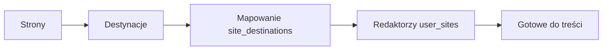

# Podręcznik administratora

Operacyjny przewodnik po panelu OmniPress. Wymagania produktowe: [PRD.md](../PRD.md). Co jest już zbudowane: [STATUS.md](./STATUS.md).

**URL produkcji:** https://omni-press.vercel.app/admin

---

## 1. Pierwsza konfiguracja (kolejność)

1. **Strona** (`/admin/sites`) — np. „UG Miedzna”, slug `ug-miedzna`.
2. **Destynacja** (`/admin/destinations`) — WordPress i/lub GitHub→Astro.
3. **Mapowanie** — na stronie: *Destynacje* → zaznacz kanały, ustaw domyślną.
4. **Redaktor** (`/admin/editors`) — przypisz strony + domyślna strona.
5. Redaktor loguje się na `/login` → `/dashboard`.

Szczegóły wdrożenia technicznego: [WDROZENIE.md](./WDROZENIE.md).

---

## 2. Strony (`/admin/sites`)

| Pole | Opis |
|------|------|
| Nazwa | Wyświetlana w panelu |
| Slug | Identyfikator techniczny (`a-z`, `0-9`, myślnik) |
| Aktywna | Nieaktywna strona — bez nowych wpisów (docelowo) |

**Destynacje strony:** `/admin/sites/[id]/destinations` — tylko powiązane destynacje pojawią się przy akceptacji wpisu.

---

## 3. Destynacje (`/admin/destinations`)

### WordPress

| Pole | Przykład |
|------|----------|
| URL REST API | `https://gmina-miedzna.pl/wp-json/wp/v2` |
| Login | użytkownik WP |
| Hasło aplikacji | z WP → Użytkownicy → Hasła aplikacji |

### GitHub → Astro

| Pole | Przykład |
|------|----------|
| Repozytorium | `mbatorowicz/gmina-miedzna.pl` |
| Branch | `main` |
| Ścieżka contentu | `src/content/aktualnosci` |
| Token PAT | uprawnienia `repo` |

**Credentials** są szyfrowane (`ENCRYPTION_KEY` na Vercel). Bez klucza — zapis konfiguracji bez sekretów (tylko dev).

Publikacja na WP/Astro — **Faza 4** (dispatcher). Po akceptacji wpisu powstają wpisy `publish_logs` ze statusem `pending`.

---

## 4. Redaktorzy (`/admin/editors`)

- Zaznacz **dostępne strony**.
- Ustaw **domyślną stronę** (używaną przy „+ Nowy artykuł”).
- Redaktor widzi **tylko własne** wpisy; nie widzi destynacji ani tokenów.

---

## 5. Akceptacja wpisów

1. `/admin` → sekcja *Do akceptacji* → wpis.
2. **Zaakceptuj:** wybierz destynacje → *Zaakceptuj i przygotuj publikację*.
   - Status wpisu: `published` (wewnętrznie zaakceptowany).
   - Kolejka: `publish_logs` = `pending` (Faza 4 wykona publikację).
3. **Odrzuć:** obowiązkowe uwagi → redaktor widzi `rejection_note` i może poprawić szkic.

---

## 6. API (admin, POST)

| Ścieżka | Akcja |
|---------|--------|
| `/api/admin/sites/create` | Nowa strona |
| `/api/admin/sites/[id]/save` | Zapis strony |
| `/api/admin/sites/[id]/destinations` | Mapowanie destynacji |
| `/api/admin/destinations/create` | Nowa destynacja |
| `/api/admin/destinations/[id]/save` | Zapis destynacji |
| `/api/admin/editors/[id]/sites` | Przypisanie redaktora |
| `/api/admin/posts/[id]/approve` | Akceptacja |
| `/api/admin/posts/[id]/reject` | Odrzucenie |

Wymaga sesji admina (`requireAdmin`).

---

## 7. Typowe problemy

| Problem | Rozwiązanie |
|---------|-------------|
| Brak destynacji przy akceptacji | Mapowanie w `/admin/sites/.../destinations` |
| Redaktor „Brak strony” | `/admin/editors` — przypisz stronę |
| Credentials nie zapisują się | Ustaw `ENCRYPTION_KEY` na Vercel |
| Wpis nie w pending | Redaktor musi wysłać do akceptacji |
