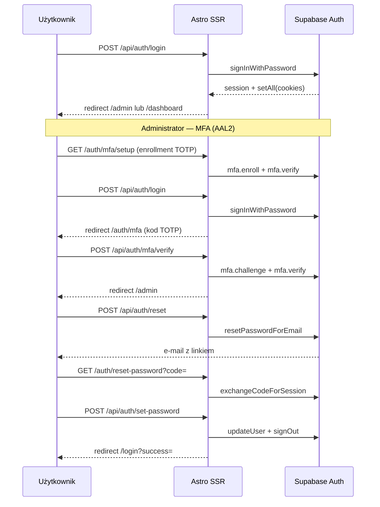

# Autoryzacja OmniPress

## Przepływy

## Warstwy kodu

| Plik | Rola |
|------|------|
| `src/lib/supabase/cookies.ts` | Adapter `getAll`/`setAll` + merge ciasteczek w tym samym żądaniu |
| `src/lib/supabase/server.ts` | Klient SSR |
| `src/lib/auth/session.ts` | `getUser`, profil |
| `src/lib/auth/routes.ts` | Ścieżki publiczne / chronione / `isAdminApiPath` |
| `src/i18n/pl/auth.ts` | Napisy auth (SSOT) |
| `src/i18n/map-auth-error.ts` | Mapowanie błędów Supabase |
| `src/lib/auth/require.ts` | `requireAuth(locals)` — sesja z middleware |
| `src/lib/auth/recovery-redirect.ts` | Rozróżnienie `?code=` recovery vs magic link |
| `src/lib/auth/guard-request.ts` | Rate limit + blokada cross-origin POST (auth) |
| `src/lib/auth/origin.ts` | Wykrywanie cross-origin POST |
| `src/lib/auth/rate-limit.ts` | Limit prób logowania / resetu (async, współdzielony store) |
| `src/lib/auth/rate-limit-store.ts` | Upstash Redis / Supabase RPC / pamięć (testy) |
| `src/lib/auth/mfa.ts` | MFA admin: AAL2, redirect setup/challenge |
| `src/lib/security/headers.ts` | Nagłówki bezpieczeństwa HTTP + CSP z nonce |
| `src/lib/security/nonce.ts` | Generator nonce CSP |
| `src/middleware.ts` | Cienki entrypoint → `lib/middleware/pipeline.ts` |
| `src/lib/middleware/pipeline.ts` | Sesja SSR, guard tras HTML i `/api/admin/*`, `locals.pendingCount` (odznaka kolejki) |
| `src/lib/api/guards.ts` | `guardAuthRedirect`, `guardAdminRedirect`, `guardAuthJson`, `guardAdminJson` |
| `src/lib/api/response.ts` | `jsonOk`, `jsonError` — ujednolicony JSON |
| `src/lib/api/worker.ts` | Autoryzacja cron (`CRON_SECRET`) |
| `src/pages/api/*` | Cienkie handlery — guard + logika z `lib/` |
| `src/pages/api/auth/*` | Mutacje auth (POST only) |

## Bezpieczeństwo

1. **Rejestracja** — wyłączona w Supabase (`disable_signup: true` przez `npm run setup:auth-urls`). Konta tylko przez admina.
2. **RLS profiles** — trigger `profiles_guard_self_update` blokuje zmianę `role` i `default_site_id` przez redaktora (`npm run setup:profiles-guard`).
3. **Auth POST** — rate limit (20 / 15 min / IP, Upstash lub Supabase RPC) + odrzucenie żądań z obcym `Origin` albo bez `Origin` i bez `Sec-Fetch-Site: same-origin`. IP: na Vercel hop platformy (`x-vercel-forwarded-for`, potem pierwszy hop `X-Forwarded-For`). Goły `x-real-ip` od klienta jest ignorowany.
4. **MFA admin** — TOTP obowiązkowy (AAL2); enrollment `/auth/mfa/setup`, challenge `/auth/mfa`.
5. **CSP** — nonce per żądanie; `script-src 'self' 'nonce-…' 'wasm-unsafe-eval'` (pdf.js). Brak `unsafe-inline`, więc każdy `<script>` w HTML musi mieć nonce **albo** być osobnym plikiem — patrz [KONWENCJE.md](./KONWENCJE.md#8-skrypty-klienta-i-csp). `img-src` bez Supabase — załączniki idą z własnego origin.
6. **Reset hasła** — zawsze ten sam komunikat sukcesu (brak enumeracji e-maili).
7. **Logowanie** — generyczny komunikat błędu (`invalidCredentials`).
8. **Nagłówki** — `X-Frame-Options`, `HSTS` (prod), `nosniff`, `Referrer-Policy`, CSP (middleware).
9. **Upload** — weryfikacja magic bytes + limit rozmiaru (`lib/posts/upload-verify.ts`); bez surowych błędów storage w JSON.
10. **Załączniki** — bucket `post-assets` jest prywatny (`npm run setup:storage-private`). Plik wychodzi wyłącznie przez `/api/posts/{id}/assets/{assetId}/file` (sesja + `canViewPostAssets`); publikacja czyta bajty klientem Storage i commituje je do repo strony. Zero adresów `/object/public/…` w panelu i w treści szkicu. Nazwa pliku i URL w panelu galerii / listy załączników idą przez `textContent` / `isSafeUrl`, nie przez `innerHTML`.
11. **CSRF mutacji panelu** — middleware odrzuca POST/PUT/PATCH/DELETE na `/api/posts/*` i `/api/admin/*` z obcego lub brakującego `Origin` (wyjątek: `Sec-Fetch-Site: same-origin`). Worker cron (`/api/worker/*`) i GET (proxy pliku) nie podlegają.

## Ochrona API

| Warstwa | Zachowanie |
|---------|------------|
| Middleware mutacje `/api/posts/*`, `/api/admin/*` | Obcy / brak Origin → JSON 403 (`api.csrf`) |
| Middleware `/api/admin/*` | Brak sesji → JSON 401; redaktor → JSON 403 |
| Handler `guardAdminRedirect` | Defense in depth dla form POST (redirect `/login` lub `/dashboard`) |
| Handler `guardAuthJson` / `guardAdminJson` | Fetch API — JSON 401/403 z i18n |
| `loadEditablePost` / `loadSubmittablePost` | Dostęp do wpisu w `lib/posts/access.ts` |

Trasy `/api/posts/*` i `/api/sites/*` — dostęp do wpisu w handlerze (`loadEditablePost`). Mutacje `/api/posts/*` i `/api/admin/*` dodatkowo: middleware Origin (S-4).

## Zasady

1. **Logowanie i reset** — wyłącznie przez `/api/auth/*`, nigdy logika POST w `.astro`.
2. **Sesja** — ciasteczka `httpOnly`; po `signIn` używamy `data.user` z odpowiedzi.
3. **Reset hasła** — formularz serwerowy → `set-password` → wylogowanie → logowanie nowym hasłem.
4. **Link z `#access_token`** — skrypt wywołuje `/api/auth/establish-session`, potem formularz SSR.
5. **Redirect URLs** w Supabase: `https://omni-press.cncsolutions.dev/**` (Site URL = ta sama domena).
6. **`?code=`** — middleware kieruje na `/auth/reset-password` tylko przy recovery (`type=recovery`, `/login?mode=reset`); inaczej na `/auth/callback`. Link resetu powinien mieć `redirectTo` = `/auth/reset-password` (`authResetPasswordUrl()`).

## Endpointy API

| Metoda | Ścieżka | Opis |
|--------|---------|------|
| POST | `/api/auth/login` | Logowanie |
| POST | `/api/auth/reset` | Wyślij link resetu |
| POST | `/api/auth/set-password` | Zapis nowego hasła (sesja recovery) |
| POST | `/api/auth/establish-session` | Token z hash → ciasteczka |
| POST | `/api/auth/signout` | Wylogowanie |
