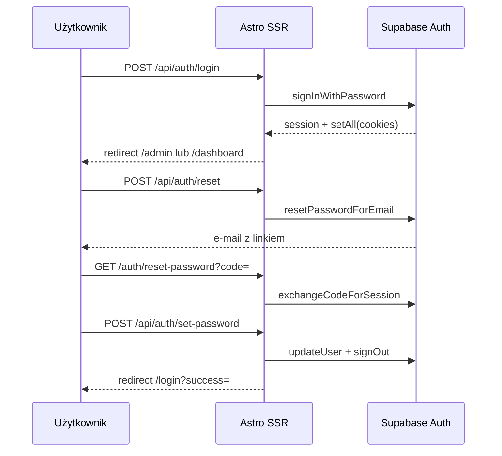

# Autoryzacja OmniPress

## Przepływy

## Warstwy kodu

| Plik | Rola |
|------|------|
| `src/lib/supabase/cookies.ts` | Adapter `getAll`/`setAll` + merge ciasteczek w tym samym żądaniu |
| `src/lib/supabase/server.ts` | Klient SSR |
| `src/lib/auth/session.ts` | `getUser`, profil |
| `src/lib/auth/routes.ts` | Ścieżki publiczne / chronione |
| `src/lib/auth/messages.ts` | Komunikaty PL |
| `src/middleware.ts` | Sesja na każde żądanie, guard tras |
| `src/pages/api/auth/*` | Mutacje auth (POST only) |

## Zasady

1. **Logowanie i reset** — wyłącznie przez `/api/auth/*`, nigdy logika POST w `.astro`.
2. **Sesja** — ciasteczka `httpOnly`; po `signIn` używamy `data.user` z odpowiedzi.
3. **Reset hasła** — formularz serwerowy → `set-password` → wylogowanie → logowanie nowym hasłem.
4. **Link z `#access_token`** — skrypt wywołuje `/api/auth/establish-session`, potem formularz SSR.
5. **Redirect URLs** w Supabase: `https://omni-press.vercel.app/**` (Site URL = ta sama domena).

## Endpointy API

| Metoda | Ścieżka | Opis |
|--------|---------|------|
| POST | `/api/auth/login` | Logowanie |
| POST | `/api/auth/reset` | Wyślij link resetu |
| POST | `/api/auth/set-password` | Zapis nowego hasła (sesja recovery) |
| POST | `/api/auth/establish-session` | Token z hash → ciasteczka |
| POST | `/api/auth/signout` | Wylogowanie |
