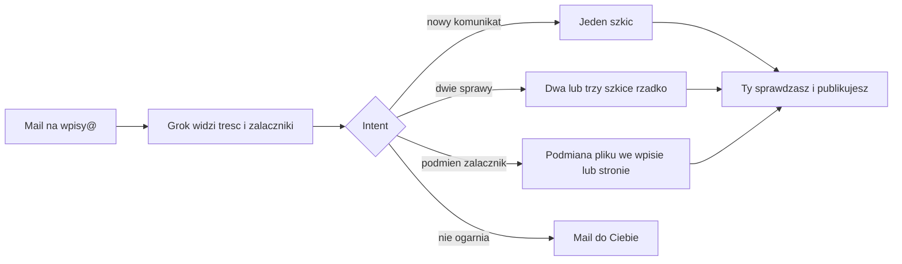

# Plan: Grok na skrzynce — widzi materiał, intent, podmiana

**Status:** wdrożone (0.19.2). Grok 4.6 dostaje załączniki jako **obrazy** (`type: image`), nie jako `file`.  
**Role:** PM → Architect → BE → DevSecOps → QA  
**SSOT operacyjne:** [ADMIN.md](./ADMIN.md) §5.3, [WDROZENIE.md](./WDROZENIE.md), [STATUS.md](./STATUS.md), [AUTH.md](./AUTH.md).

Grok na `wpisy@inbound.cncsolutions.dev` ma **oglądać** treść maila i załączniki, rozumieć co z nich zrobić i **nie zgadywać** z nazw plików. Grok Bot na laptopie jest poza tym planem.

---

## PM — po co

Urząd i szkoła przekazują materiały mailem. Ty wrzucasz je na skrzynkę. Grok ma zachować się jak redaktor, który **otworzył załączniki**:

1. **Norma — nowy komunikat.** Jeden mail = jeden szkic. Kilka plików przy jednej sprawie (plakat, ulotka, pismo) zostaje w jednym wpisie.
2. **Wyjątek — podział.** Dwa albo trzy szkice tylko gdy w przesyłce są **osobne sprawy** dla odbiorcy strony (inny obowiązek, inne wydarzenie, inna data akcji). Trafia się rzadko.
3. **Podmiana.** Mail prosi o wymianę załącznika w **już opublikowanym** wpisie albo na stronie stałej. To nie jest nowy artykuł.
4. **Pytanie.** Gdy Grok nie ogarnie (nieczytelny skan, nie wiadomo czy nowy wpis czy podmiana, dwa cele pasują) — **bez zgadywania**, mail zwrotny **do Ciebie** (envelope From / allowlista). Urząd i szkoła nie dostają bota.

Nic nie idzie na `gmina-miedzna.pl` ani `sp-miedzna.pl` bez Twojej publikacji w panelu.

Jednostka (gmina vs szkoła) **bez zmian:** hop, który przekazał maila do Ciebie — [stan 0.18](#jednostka--bez-zmian).

---

## Stan dziś (0.18) — dlaczego zgaduje

Kod woła `generateObject` z **samym tekstem** (`src/lib/inbound/ai-client.ts`). Po ekstrakcji **bajty plików giną** (`collect-attachment-texts.ts`). PDF: warstwa tekstowa, max 8 stron, bez OCR (`extract-pdf-text.ts`). JPG/PNG: w promptcie nazwa + „brak warstwy tekstowej”. Model `xai/grok-4.1-fast-non-reasoning` na AI Gateway **umie przyjąć obraz i PDF** — pipeline tego nie wysyła.

Druga tura i klastry z **nazw plików** (`enrich-retry.ts`, `message-clusters.ts`) pchają w podział. To pasuje do rzadkiego maila z dwoma sprawami i psuje normę (jeden komunikat, kilka plików).

Skrzynka zawsze **zakłada nowy szkic**. Nie ma ścieżki „to poprawka do istniejącego wpisu / strony”.

Webhook (0.19.2): timeout modelu 240 s po rasterze, `maxDuration` 300 s (Fluid Hobby).

---

## Zachowanie docelowe



### Nowy komunikat (norma)

- Jeden szkic. Tytuł nazywa sprawę (zakaz: Plakaty, Załączniki, Informacja, Proszę o publikację).
- Plakat / ulotka / zaproszenie / skan 1–2 stron → podgląd (`embed`). Uchwała, regulamin, lista → link.
- Pismo przewodnie, „proszę opublikować”, pismo do służb przy materiałach na stronę → `drop` (ani treść, ani załącznik, ani osobny wpis).
- Kategoria: Aktualności jako domyślna na komunikat dla mieszkańców. Węższą tylko gdy materiał wyraźnie do niej należy. Ochrona ludności = stałe materiały kryzysowe, nie plakat weterynaryjny.
- DOCX bez pieczęci i podpisu: grafiki do galerii (pierwsza = zajawka), Word nie zostaje — jak 0.17.

### Podział (wyjątek)

Tylko gdy Grok **widzi** dwie (max trzy) sprawy dla odbiorcy. Nie dziel, bo są dwa pliki, dwa formaty, dwa podtytuły tej samej akcji. Kod **nie** wymusza liczby szkiców z tokenów w nazwach.

### Podmiana załącznika

Sygnały w treści: podmień, nowa wersja, zamień plik, popraw załącznik w artykule / na stronie.

Cel: istniejący wpis (`posts` + `assets.post_id`) albo strona stała (`site_pages` + `assets.page_id`) na jednostce z hopu.

- **Pewne trafienie** (jeden cel): otwórz poprawkę w panelu, podmień plik, **bez** commita GitHub i **bez** publikacji. Wpis: `reopenPostForEditing` → `draft` (na stronie zostaje stara wersja). Strona: nowy/zastąpiony asset w bazie, status jak szkic nowszy. Telegram: podmiana w …, sprawdź i opublikuj — bez Akceptuj.
- **Niepewne** (brak URL, dwa podobne tytuły, kilka plików o tej nazwie): zero zapisu, mail do Ciebie z kandydatami (tytuł + link panelu).

### Doprecyzowanie

Bez szkicu i bez podmiany. Mail z konkretnym pytaniem. Nie dopytuj o kategorię, gdy może zostać Aktualności. Nie dopytuj przy każdej niepewności.

Odpowiedź na ten mail (wątek) wraca na `wpisy@` z **tymi samymi załącznikami oryginału** + Twoją dopowiedzią; Grok liczy od nowa.

---

## Architect

### 1. Wizja — `generateObject` z plikami

Zostaje Vercel AI Gateway i ten sam model (env `INBOUND_AI_MODEL` jak dziś). Wejście: `messages` z częścią tekstową **oraz** `file`:

- obraz: `mediaType` `image/jpeg` | `image/png` | `image/webp` | `image/gif`
- PDF: **nie** native `application/pdf` (Gateway/xAI → 400 na inline bajtach). Strony 1–2 jako JPEG (`pdfjs` + `@napi-rs/canvas` + Sharp).

Kompresja JPG/PNG: istniejący Sharp (`lib/posts/optimize-image.ts`), krawędź ok. 1600 px — czas i rozmiar żądania.

DOCX: tekst jak dziś + grafiki z `word/media` jako `file` (nie sam opis).

XLSX / ZIP / GPKG: nie jako wizja — nazwa w tekście; plik ląduje przy szkicu, gdy intent to `create`.

Inwentarz (`InboundFileInventory`) **trzyma bajty** do wizji. Warstwa tekstowa PDF zostaje w promptcie jako pomoc, nie zamiast obrazu.

Gdy Gateway odrzuci PDF: raster stron 1–2 do JPEG. Native PDF nie wysyłamy.

Limit: do 8 załączników jak dziś. Do modelu nie pchać 50 MB w base64 — obciąć / skompresować ładunek wizji.

### 2. Schema JSON (`enrich-schema.ts`)

- `intent`: `create` | `replace` | `clarify`
- `posts[]`: zawsze 1 (tylko `create`). Jeden mail = jeden wpis.
- `replace`: `{ target: 'post' | 'page', hint: string }` — tytuł, slug, URL, nazwa pliku z maila
- `clarification`: `{ needed: boolean, question: string }` — krótko, po polsku

`clarify` albo niepewny `replace`: `prepare-inbound-draft` **nie** tworzy postów. Koniec z fallbackiem „temat maila = tytuł” przy nieudanym enrichment — to zgadywanie.

Prompt systemowy (`inbound-ai.ts`): oglądasz załączniki; domyślnie jeden wpis; nie dziel bo dwa pliki; podmiana gdy treść prosi o wymianę w już opublikowanym; nie zgaduj z nazwy; nieczytelny plakat → `clarify`.

Retry „musisz mieć N szkiców, bo klastry z nazw” — **usunąć albo wyłączyć**. `coalesceDrafts` może zostać jako siatka na nadmiar ujęć, nie jako generator podziału.

### 3. Matcher podmiany (`lib/inbound/match-replace-target.ts`)

Tylko rekordy jednostki z hopu. Kolejność:

1. URL albo slug w treści maila (wpis `/kategoria/slug` albo strona z prefiksem).
2. Dokładna nazwa pliku wśród `assets.filename` / basename `storage_path` wpisów i stron tej jednostki — **jedno** trafienie.
3. Tytuł albo jednoznaczny fragment tytułu — **jedno** trafienie.

Więcej niż jeden kandydat albo zero → `clarify`. Żadnego „najbliższy Levenshtein i podmień”.

Apply (pewne): nowy `lib/inbound/apply-replace.ts` — upload jak inbound, podmiana wiersza `assets` (ten sam `display_mode` co stary plik, chyba że Grok poda embed/link), usunięcie starego obiektu Storage dopiero po udanym wgraniu nowego. Publikacja: człowiek w panelu.

### 4. Mail zwrotny

Domena `inbound.cncsolutions.dev` ma DKIM/SPF do wysyłki ([WDROZENIE.md](./WDROZENIE.md)).

- From: `wpisy@inbound.cncsolutions.dev`
- To: envelope From (Ty)
- Treść z i18n; nie logować treści urzędowej ([AUTH.md](./AUTH.md))

Migracja `inbound_messages`: `post_id` nullable; `status` `drafted | replaced | awaiting_clarification`. Unikalny `message_id` zostaje — retry webhooka nie wysyła pięciu pytań.

Wątek: `In-Reply-To` / temat `Re:` + allowlista → oryginalny `message_id`, nowa treść, załączniki z Resend **oryginału**.

### 5. Czas (Fluid Hobby, 300 s)

Wizja + myślenie Grok 4.6 nie mieści się w starym limicie 60 s.

- Po poprawnym podpisie: **200 od razu**, ingest w `waitUntil` (wzorzec `lib/publish/trigger-worker.ts`).
- `maxDuration` **300 s** na webhooku i replay (Fluid na Hobby). Timeout `generateObject` **60 s**, start po rasterze PDF. Jedna tura, bez łańcucha myślenia (`spacexai/grok-4.1-fast-non-reasoning`).
- Timeout / błąd Gateway: **nie** surowy szkic 1:1. Clarification albo Telegram: nie przerobiłem — replay w panelu (`POST /api/admin/inbound/replay`).
- Pro / 800 s tylko jeśli po deployu Vercel obetnie 300 s albo ładunek obrazów nadal pada na czasie.

### 6. Bezpieczeństwo

Bez zmian: podpis Svix, allowlista From, tylko `draft` / szkic strony, zero publikacji z webhooka, Origin nie dotyczy inbound. Treść nie w logach. Mail wychodzi tylko na adres z allowlisty (envelope). RLS: service_role jak dziś.

---

## Jednostka — bez zmian

```
autor pisma → …przekazujący A → przekazujący B → do Ciebie → Ty na inbound
```

Liczy się hop B (pierwszy From spoza allowlisty i envelope). Mapa: `INBOUND_SITE_BY_EMAIL` → `INBOUND_SITE_BY_DOMAIN` → `INBOUND_DEFAULT_SITE_SLUG`. Nieznana domena → gmina. Szkoła tylko przy domenie szkoły. Wszystkie skutki jednego maila (szkice albo jedna podmiana) na tę samą jednostkę.

---

## Kolejność wdrożenia

1. Inwentarz z bajtami + multimodal `generateObject` + prompt „widzisz pliki, domyślnie jeden wpis”. Replay w panelu do weryfikacji.
2. Usunąć wymuszanie podziału z klastrów nazw. Test: kilka plików jednej sprawy = 1 szkic; dwie sprawy = 2.
3. Schema `clarify` + brak szkicu + mail do Ciebie + idempotencja + wątek odpowiedzi.
4. Intent `replace` + matcher + apply na wpisie i stronie stałej + Telegram.
5. `waitUntil` na webhooku, limity ładunku, docs (ADMIN §5.3, STATUS, WDROZENIE, AUTH, CHANGELOG).

---

## Kryteria akceptacji

- Skan-plakat (PDF bez warstwy tekstowej albo JPG) daje tytuł ze **sprawy na obrazku**, nie z tematu „Plakaty”; plik jako podgląd.
- Mail z jednym komunikatem i kilkoma plikami → **jeden** szkic.
- Mail z dwiema sprawami (jak wczoraj) → dwa szkice, pismo `drop`.
- „Podmień załącznik w [tytuł / URL]” + jeden pewny cel → poprawka w panelu, produkcja bez zmian, aż opublikujesz.
- Dwuznaczna podmiana albo nieczytelny materiał → brak nowego wpisu, mail do Ciebie, Telegram bez Akceptuj.
- Odpowiedź w wątku używa starych załączników + Twojej dopowiedzi.
- Obcy From nadal `{ ignored: true }`. Grok Bot nie jest kanałem publikacji.

---

## QA

- Testy jednostkowe: prompt/schema, 1 vs 2 szkice, clarify bez insertu, matcher (URL / nazwa / tytuł / dwuznaczność), apply replace (post i page), idempotencja `message_id`.
- `npm test`, `npm run build`.
- Replay na prawdziwej przesyłce ze skanem (staging panelu). Nie kończyć na teście bez sprawdzenia szkicu w `/admin/posts`.

---

## Pliki (główne)

- `src/lib/inbound/ai-client.ts`, `enrich.ts`, `enrich-prompt.ts`, `enrich-schema.ts`, `enrich-retry.ts`, `inbound-ai-config.ts`
- `collect-attachment-texts.ts` (+ live)
- `process-received.ts`, `handle.ts`, `prepare-inbound-draft.ts`, `notify-draft.ts`
- nowe: `clarify-mail.ts`, `match-replace-target.ts`, `apply-replace.ts` (logika vs baza wg KONWENCJE: `*-model.ts`)
- `src/i18n/pl/inbound-ai.ts`, `inbound.ts` (mail, Telegram, clarify)
- migracja `inbound_messages` + `setup:inbound-email` jeśli skrypt bootstrapu trzeba rozszerzyć
- testy obok powyższych
- po wdrożeniu: ADMIN §5.3, STATUS, WDROZENIE, AUTH, CHANGELOG — ten plik na **wdrożone**

---

## Poza zakresem

- Grok Bot na laptopie jako drugi importer (materiały spoza poczty / sprawdzenie stagingu — ręcznie, nie w kodzie OmniPress)
- Mail do hopu (urząd, szkoła)
- OCR jako osobny silnik (Tesseract) — zastępuje wizja modelu
- Auto-publikacja, push na `origin/main` z webhooka
- Poprawa już otwartego szkicu w panelu (replay zostaje)
- Upgrade Vercel Pro wyłącznie pod timeout; najpierw kompresja + `waitUntil`

---

## Grok Bot na laptopie

Nie zastępuje skrzynki. Nie logować go do publikacji. Może pomóc przy pliku z dysku albo przy sprawdzeniu [gmina-miedzna.cncsolutions.dev](https://gmina-miedzna.cncsolutions.dev) / [sp-miedzna.cncsolutions.dev](https://sp-miedzna.cncsolutions.dev) — to nie jest ten plan.
