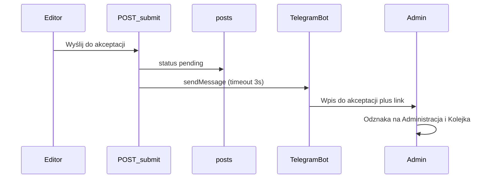

# Plan: powiadomienie o wpisie do akceptacji

**Status:** wdrożone (0.14.0) — odznaka w panelu, wiadomość Telegram z przyciskiem *Akceptuj*; webhook `setup:telegram-webhook`.  
**Role:** PM → Architect → UX → FE/BE → DevSecOps → QA

Gdy redaktor kliknie *Wyślij do akceptacji*, administrator ma dostać sygnał od razu (telefon) i widzieć liczbę oczekujących wpisów przy każdym wejściu do panelu.

Poza zakresem: e-mail, Teams, WhatsApp oraz maile do redaktora o akceptacji/odrzuceniu (to nadal pozycja planowana w [STATUS.md](./STATUS.md)).

## Stan dziś

- Endpoint [`src/pages/api/posts/[id]/submit.ts`](../src/pages/api/posts/[id]/submit.ts) ustawia `status: 'pending'` i przekierowuje — nikogo nie woła.
- Kolejka na `/admin` pokazuje listę dopiero po wejściu na tę stronę.
- [`src/components/shell/AppHeader.astro`](../src/components/shell/AppHeader.astro) i [`src/components/shell/AdminSidebar.astro`](../src/components/shell/AdminSidebar.astro) nie mają licznika.
- Brak jakiegokolwiek nadawcy wiadomości (Resend/SMTP/webhook).

## Przepływ

## 1. Telegram — po udanym submit

Nowy moduł `src/lib/notify/` (warstwa danych oddzielona od czystej logiki, zgodnie z [KONWENCJE.md](./KONWENCJE.md)):

- [`src/lib/notify/review-model.ts`](../src/lib/notify/review-model.ts) — treść wiadomości i URL recenzji (czyste funkcje, testowalne).
- [`src/lib/notify/telegram.ts`](../src/lib/notify/telegram.ts) — `sendMessage` na `https://api.telegram.org/bot{token}/sendMessage`; brak tokenu/chat_id = no-op; błąd sieci nie cofa submitu.
- [`src/lib/notify/review.ts`](../src/lib/notify/review.ts) — składa tytuł, nazwę strony, autora i wywołuje Telegram.

Wywołanie w `submit.ts` **po** udanym `update`, **przed** redirectem, z `AbortSignal` ~3 s. Na Vercel `void fetch()` po redirectcie bywa ucinane — dlatego await z timeoutem.

Treść (i18n w `src/i18n/pl/notify.ts`), zwykły tekst bez HTML:

- nagłówek „Wpis do akceptacji”
- tytuł, strona, autor (`profiles.display_name`, inaczej i18n fallback)
- link: `{APP.productionOrigin}/admin/posts/{id}` — z telefonu zawsze produkcja, nie localhost

Nazwę strony i autora dociągamy osobnym krótkim odczytem (submit ma tylko `PostRow` z [`src/lib/posts/access.ts`](../src/lib/posts/access.ts)).

Env (opcjonalne — bez nich submit działa jak dziś):

- `TELEGRAM_BOT_TOKEN`
- `TELEGRAM_CHAT_ID` (czat prywatny z botem albo grupa administratorów)

Dopisane w [`src/env.d.ts`](../src/env.d.ts), [WDROZENIE.md](./WDROZENIE.md), [STATUS.md](./STATUS.md).

## 2. Odznaka w panelu

Licznik: `count(*)` wpisów `status = 'pending'` — [`src/lib/admin/pending-count.ts`](../src/lib/admin/pending-count.ts).

Pobranie w middleware ([`pipeline.ts`](../src/lib/middleware/pipeline.ts)) **tylko dla admina** na `/admin` i `/dashboard` (`locals.pendingCount`). Layout i shell tylko czytają propsy — `AppLayout` jest importowany z komponentów, więc nie może sam sięgać po bazę (lint warstw).

Mały komponent np. `PendingCountBadge.astro`: pill z liczbą, widoczny gdy `count > 0`. Klasy `ui-*` (amber jak `ui-badge--pending`) w [`src/styles/ui/shell.css`](../src/styles/ui/shell.css) / [`src/styles/ui/sidebar.css`](../src/styles/ui/sidebar.css) — bez surowych `bg-amber-*` w `.astro`.

Miejsca:

- nagłówek: przy *Administracja* (widać też z `/dashboard`)
- sidebar: przy *Kolejka wpisów*

`aria-label` z i18n, np. „Administracja, do akceptacji: 3” — liczba nie zostaje tylko wizualna.

## 3. Dokumentacja i copy

- [ADMIN.md](./ADMIN.md) — skąd wiadomo, że coś czeka (Telegram + odznaka).
- [WDROZENIE.md](./WDROZENIE.md) — BotFather, chat_id, env.
- [STATUS.md](./STATUS.md) / [CHANGELOG.md](../CHANGELOG.md) — funkcja zrobiona; e-mail akceptacja/odrzucenie zostaje w „nie zaimplementowane”.
- [PRD.md](../PRD.md) — dopisać powiadomienie admina (Telegram), e-mail nadal poza zakresem.

## 4. Testy i wdrożenie

- Unit: treść wiadomości, URL recenzji, no-op bez env, timeout/błąd nie rzuca; licznik 0 vs n.
- `npm test`, `npm run build`.
- E2E: po zalogowaniu admina przy istniejącym pending — odznaka przy *Administracja* (istniejące specy z pending, np. korekta wpisu). Telegram w E2E nie wołamy.
- Telegram na produkcji: **krok ludzki** — bot w @BotFather + napisanie do bota / dodanie do grupy + `chat_id`. Potem agent: `vercel env add` (prod) i deploy. Bez tokenu odznaka i tak działa.

## Kryteria akceptacji

- Redaktor wysyła szkic → w czacie Telegrama jest tytuł, link do `/admin/posts/{id}` i przycisk *Akceptuj*.
- Awaria Telegrama nie blokuje wysłania wpisu.
- Admin widzi liczbę pending przy *Administracja* i *Kolejka wpisów*; przy 0 odznaki nie ma.
- Zero hardkodowanych napisów poza `src/i18n/pl/`.

## Zadania

1. Moduł `lib/notify`: treść wiadomości, klient Telegram, wywołanie po udanym submit.
2. Licznik pending w `AppLayout` + odznaka w `AppHeader` i `AdminSidebar`.
3. i18n notify/layout, STATUS, ADMIN, WDROŻENIE, CHANGELOG, PRD.
4. Testy jednostkowe, `npm test` + `build`; weryfikacja odznaki w przeglądarce.
