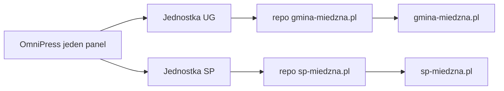

# Plan: destynacja SP Miedzna (`sp-miedzna.pl`)

**Status:** kod na `main` (2026-09-17, [PR #1](https://github.com/mbatorowicz/sp-miedzna.pl/pull/1)). WordPress [sp-miedzna.pl](https://sp-miedzna.pl) zostaje produkcją do cutoveru DNS. Produkcja Vercel: [sp-miedzna-pl.vercel.app](https://sp-miedzna-pl.vercel.app). Staging: [sp-miedzna.cncsolutions.dev](https://sp-miedzna.cncsolutions.dev). Jednostka OmniPress slug `sp-miedzna`.  
**Role:** PM → Architect → UX → FE/BE → DevSecOps → QA

Druga jednostka w tym samym panelu OmniPress. Osobne repo Astro, osobny projekt Vercel, destynacja `github_astro`. Szablon szkolny (więcej koloru niż UG), migracja całej treści WP, sanityzacja, optymalizacja zdjęć.

Poza zakresem tej destynacji: upgrade Vercel Pro, zmiana crona, przebudowa `gmina-miedzna.pl`.

## Stan dziś

- OmniPress obsługuje jedną jednostkę: UG Miedzna → repo `mbatorowicz/gmina-miedzna.pl` → `gmina-miedzna.pl`.
- Kreator jednostki jest gotowy: `/admin/units/new` (nazwa, slug, kanał GitHub).
- Szkoła żyje na WordPressie. REST otwarte: `https://sp-miedzna.pl/wp-json/wp/v2/`.
- Inwentarz WP (2026-09-17): ~102 wpisy (kategorie = lata szkolne 2020/21–2025/26), 19 stron, galerie (NextGEN / featured).

## Architektura docelowa

Nie wpinamy szkoły w repo gminy. Szkoła ma inną IA, paletę i menu.

| Warstwa | Wartość |
|---------|---------|
| Panel | ten sam (`omni-press.cncsolutions.dev`) |
| Jednostka | slug `sp-miedzna`, destynacja `github_astro` |
| Repo | nowe, kontrakt jak gmina (`omnipress-layout.json`, `news`/`pages`, `rehype-sanitize`, gałąź `staging` na kod, `main` na treść) |
| Vercel | nowy projekt; staging np. `sp-miedzna.cncsolutions.dev` |
| Produkcja | `sp-miedzna.pl` po DNS cutover |
| Treść | `src/content/news`, `src/content/pages`, układ `folder` |
| Widgety UG | IMGW / CERT / odpady **wyłączone** w layoucie; ID komponentów zostają w kontrakcie |

## Szablon (UX)

UG: granat `#1e4b85` + pomarańcz `#fca311` ([`gmina-miedzna.pl/src/styles/global.css`](../../gmina-miedzna.pl/src/styles/global.css)).

Szkoła: ten sam chrome (topbar, header, menu, karty, sidebar), inna paleta.

| Token | Propozycja |
|-------|------------|
| Primary | `#2a5f47` (stonowana zieleń; było `#0f7a4b`) |
| Primary light / dark | `#3d7358` / `#1a3d2e` |
| Secondary (słońce) | `#f5c518` |
| Accent (niebo) | `#2b9ed6` |
| Chip roku | `#e85d4c` |
| Tło | `#f6f8f7` |

Menu robocze (z stron WP, posprzątane):

- **Szkoła** — o szkole, kadra, dokumenty
- **Dla rodziców** — druki, konsultacje, pielęgniarka, fluoryzacja, e-dziennik
- **Uczniowie** — samorząd, biblioteka, pedagog, harcerze, przedmioty
- **Kontakt**

Aktualności zostają na stronie głównej; archiwum lat szkolnych jest w prawej kolumnie.

Sidebar: BIP (`https://bipszkolapodstawowa.gminamiedzna.pl/`), lista kategorii (lata szkolne), skróty (e-dziennik, dokumenty), ostatnie wpisy. Bez pogody IMGW i CERT.

**Makieta homepage (16:9) przed forkiem repo** — belka zielona, logo + zdjęcia w `header.brand`, karty ze zdjęciem i chipem roku, kafelki skrótów, stopka z adresem. WCAG 2.1 AA: kontrast żółtego/zieleni zmierzyć; rok szkolny także słownie, nie tylko kolorem.

## Migracja treści

Źródło: WP REST. Cel: markdown + załączniki w repo szkoły.

| Typ | Źródło | Cel |
|-----|--------|-----|
| Wpisy | ~102, kategorie = lata | `src/content/news/{slug}/index.md` + galeria |
| Strony | 19 (Szkoła, Przedmioty, Kontakt, SU, Biblioteka, Pedagog, Harcerze, Dokumenty, Kadra, Informacje + COVID/fluoryzacja/deklaracja) | `src/content/pages/...` |
| Media | galerie, featured | obok markdownu; **WebP, max 1920 px** |
| Menu | WP nav | `omnipress-layout.json` → `header.navigation` |

Skrypt nowy, wzorowany na [`scripts/migrate-wp-remaining-posts.mjs`](../scripts/migrate-wp-remaining-posts.mjs) i [`scripts/lib/wp-migrate-html.mjs`](../scripts/lib/wp-migrate-html.mjs). Celuje w **repo szkoły**, nie w gminę.

**Sanityzacja (S-1 / S-2):** HTML → Markdown (Turndown); `script` / `onclick` / `javascript:` / shortcode NextGEN / emoji z treści. Historyczne strony COVID zostają (archiwum albo Informacje), też przez sanityzer. Redirecty starych URL WP w `astro.config`.

**Grafiki przy imporcie:** JPEG/PNG → WebP 1920 px; miniatury okładek osobno. Bez wrzucania oryginałów 4–8 MB. Po imporcie `lint-content-weight.mjs` w repo szkoły.

## Kolejność wykonania

1. Makieta UI → akceptacja palety i menu.
2. Repo GitHub + projekt Vercel + staging.
3. Jednostka OmniPress (`/admin/units/new`) + redaktorzy szkoły (`user_sites`).
4. Layout: menu i kategorie lat — bez treści.
5. Import stron, potem wpisów i mediów (optymalizacja w locie).
6. Przegląd galerii i ewentualnych PDF-ów.
7. Weryfikacja staging (desktop + mobile, axe).
8. DNS `sp-miedzna.pl` — jak cutover gminy: apex na Vercel, poczta nienaruszona. [WDROZENIE.md](./WDROZENIE.md).

## Hobby (dwie małe strony)

Zostaje plan Hobby. Dwa projekty dzielą 100 GB transferu i **1 równoległy build**. Szkoła to zdjęcia, nie ciężkie PDF-y UG. Pro odkładamy, aż Vercel wymusi ToS, pojawi się trzecia strona albo kolejka publikacji zacznie przeszkadzać.

## Powiązane

- [ADMIN.md](./ADMIN.md) §1 — kreator jednostki
- [STATUS.md](./STATUS.md) — destynacja `github_astro`
- [WDROZENIE.md](./WDROZENIE.md) — Vercel, DNS, token GitHub
- [AUDYT-BEZPIECZENSTWO.md](./AUDYT-BEZPIECZENSTWO.md) — S-1–S-4 (ten sam tor na nowym repo)
